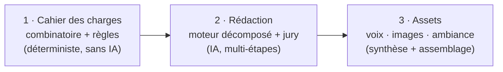
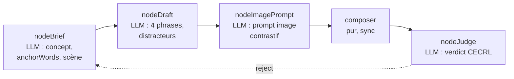

import Figure from "../../components/blocks/Figure.astro";
import Squiggle from "../../components/blocks/Squiggle.astro";
import PullQuote from "../../components/blocks/PullQuote.astro";
import Citation from "../../components/blocks/Citation.astro";

Préparer le TCF et le TEF demande des centaines d'exercices neufs, calibrés au niveau exact du candidat, avec audio et images. Les écrire à la main est intenable.

C'est le mur sur lequel je suis tombé en construisant GoFrench Academy.

Ce que j'ai fini par construire, ce n'est pas un générateur de contenu. C'est un atelier : une chaîne qui produit l'exercice, un jury qui le note, et une boucle qui le renvoie en correction tant qu'il n'est pas au niveau.

<Squiggle />

## Le produit : deux examens qui décident d'une vie

GoFrench Academy prépare deux certifications de français : le **TCF** et le **TEF**.

Ce ne sont pas des examens anodins. Ce sont eux qui ouvrent l'immigration au Canada, la naturalisation française, l'admission dans les universités francophones. Pour le candidat, le score n'est pas une note, c'est une porte.

Le TCF a 7 sections, le TEF 8 parties : compréhension orale, compréhension écrite, structures de la langue, lexique. Chaque épreuve a son format et son niveau attendu sur l'échelle **CECRL** : A1 à C2, le standard européen qui définit ce que "comprendre" veut dire à chaque palier.

Le candidat veut s'entraîner sur beaucoup d'examens blancs : refaire dix fois le même test ne sert à rien. Il faut donc un stock large, varié, chacun calibré au bon niveau. Et c'est là qu'est tout le problème.

Aujourd'hui, je me concentre sur la **compréhension orale** : c'est l'épreuve la plus exigeante à produire, parce que c'est celle qui empile le plus de composants. Un seul item demande un script de dialogue, des voix synthétisées, une ambiance sonore, un fichier audio assemblé, parfois une image, et les quatre options avec leurs distracteurs. Si la pipeline tient sur la CO, le reste suit.

<Squiggle />

## C'est quoi un bon TCF/TEF ?

Avant de générer quoi que ce soit, il faut comprendre ce qui fait un bon exercice. Le métier a son vocabulaire, et chaque terme est une contrainte que la pipeline devra respecter.

Un item de compréhension, c'est une question avec quatre réponses possibles. Une seule est correcte ; les trois autres sont des **distracteurs**. Un bon distracteur n'est pas une réponse absurde qu'on élimine d'un coup d'œil ; c'est une réponse plausible, qui piège le candidat qui a *presque* compris. Trop facile, l'item ne mesure rien ; trop tordu, il mesure la ruse plutôt que le français.

Le **champ lexical**, c'est l'ensemble du vocabulaire qui gravite autour d'un thème : pour le travail, ce sera *embauche, contrat, congé, salaire, démission*. Un exercice doit rester dans un champ lexical cohérent et adapté au niveau. À l'A1, le vocabulaire est concret et fréquent, dans des champs simples. Plus on monte, plus il s'abstrait et se spécialise.

La **diversité de niveau**, c'est l'échelle CECRL. Un exercice A1 et un exercice C1 ne se ressemblent en rien : ni le vocabulaire, ni la longueur, ni le débit de l'audio, ni le type de piège. Un bon stock couvre tous les paliers, chacun calibré précisément. Une dérive d'un seul cran fausse le diagnostic du candidat.

La **diversité de format**, c'est la forme du document. Une annonce, un message vocal, une conversation, une interview, un reportage radio. Les vrais examens varient les formats, et ils les font dépendre du niveau : l'A1 n'entend que des annonces et des messages simples, tandis que les niveaux avancés ajoutent l'interview et le débat. Un stock qui ne propose que des conversations entraîne mal.

À ça s'ajoute le **type de piège** : la bonne réponse est-elle une *paraphrase* de ce qui est dit, une *inférence* à reconstruire, une information *partielle* à recouper, ou cachée dans le *ton* de la voix ? C'est ce qui décide de la difficulté réelle, indépendamment du vocabulaire.

Un bon exercice, c'est donc l'équilibre de tout ça : le bon distracteur, le bon champ lexical, le bon niveau, le bon format, le bon piège. Cinq curseurs à régler ensemble, à chaque item.

<Squiggle />

## Le vrai problème n'est pas l'app, c'est le contenu

L'app (examens blancs, suivi, simulation) c'est du travail connu. Le mur, c'est le contenu.

Un examen blanc TCF, c'est ~39 items, chacun inédit, irréprochable, collé au niveau visé. Et un item de compréhension orale n'est pas juste un texte : c'est un script de dialogue, des voix, un fichier audio, parfois une image, et quatre options dont une seule correcte et trois distracteurs crédibles.

Multipliez par toutes les sections, tous les niveaux, et le besoin de renouveler le stock en permanence. On parle de **milliers d'exercices**.

À la main, ça demande une équipe de concepteurs certifiés à plein temps. C'est le coût qui tue ce genre de produit avant qu'il existe. La génération par IA est l'évidence, sauf qu'elle a un piège que tout le monde sous-estime.

Le naïf, c'est un gros prompt : "génère un exercice de compréhension orale niveau B1 sur le travail". Ça marche une fois. À l'échelle, ça dérive.

Le modèle glisse vers B2 sans prévenir, et surtout il se répète. C'est le défaut qui m'a le plus frappé : demandez dix exercices "niveau B1 sur le travail" et vous récupérez dix variations du même entretien d'embauche, avec les mêmes prénoms, le même bureau, presque les mêmes phrases. Le modèle retombe toujours dans ses ornières. Pour un produit dont la promesse est *beaucoup d'exercices variés*, c'est rédhibitoire.

À ça s'ajoutent les distracteurs ratés (deux bonnes réponses, ou aucune) et la dérive de niveau. Sur un produit où le niveau et la variété *sont* la valeur, laisser le modèle décider seul ne tient pas. Il fallait une chaîne qui ne lui fasse pas confiance sur parole.

J'ai donc arrêté de voir ça comme "un prompt qui génère un exercice", et commencé à le voir comme une chaîne de production en trois étapes.

<Squiggle />

## Anatomie d'une pipeline GenAI

Le réflexe courant, face à un besoin de contenu, c'est d'écrire un gros prompt et d'espérer. Ça ne tient pas à l'échelle. Une pipeline GenAI sérieuse sépare le travail en trois étapes distinctes, chacune avec sa responsabilité.

**Le cahier des charges.** Du code, sans IA, décide *quoi* produire : niveau, format, thème, piège, durée, nombre de voix. C'est déterministe et prédictible. L'IA n'a aucune latitude sur ces choix-là : ils sont arrêtés avant qu'elle n'intervienne.

**La rédaction.** L'IA exécute ce cahier des charges. Mais pas en un seul appel : la tâche est décomposée en petites étapes, chacune produisant un fragment court et vérifiable. Un examinateur, lui aussi piloté par IA, note le résultat et le renvoie en correction s'il n'est pas au niveau.

**La génération des assets.** Le texte validé décrit aussi le son et l'image voulus. Une dernière étape les fabrique concrètement : synthèse des voix, sélection dans une banque de voix, génération des images, assemblage de l'audio avec une ambiance sonore.



Le code décide *quoi*. L'IA ne fait que *comment*. Et chaque étape passe un contrôle avant la suivante. Les trois sections qui suivent détaillent chacune de ces étapes.

<Squiggle />

## 1 · Le cahier des charges : rendre le hasard prédictible

Je ne demande jamais "un exercice". Une commande aussi vague, c'est précisément ce qui fait retomber le modèle dans ses ornières. Je commence par tirer une **cellule** dans un espace combinatoire.

Une **combinatoire**, c'est l'ensemble de toutes les combinaisons possibles d'un jeu d'axes. Ici les axes sont : type d'examen, section, niveau CECRL, thème, type de piège (*paraphrase*, *inférence*, *implication par le ton*…), et un *twist* créatif (humour, variation régionale, ancrage géographique…). Une **cellule**, c'est un point précis dans cet espace : *TCF, section 1, niveau B1, thème travail, piège paraphrase, twist variation régionale*.

Avec quelques axes à poignée de valeurs chacun, l'espace explose vite à des dizaines de milliers de cellules distinctes. C'est exactement ce qu'on veut.

La combinatoire est là pour tuer la répétition. En forçant chaque exercice sur une combinaison d'axes différente, deux items ne peuvent plus converger vers le même entretien d'embauche. La variété n'est plus laissée à la chance du modèle : elle est imposée par construction, avant même que l'IA n'entre en jeu.

Le tirage suit une stratégie de couverture. Plutôt que tirer au hasard, l'algorithme privilégie à chaque coup la cellule qui couvre les valeurs d'axes les moins représentées dans le stock. Il balaie tout l'espace au lieu de s'entasser sur les combinaisons faciles, et évite de réutiliser deux fois le même piège dans une même série d'examen.

De cette cellule, un constructeur déterministe déduit le vrai **cahier des charges** : le type de document imposé (annonce, conversation, interview…), le nombre de locuteurs, la fenêtre de durée de l'audio, la liste blanche des pièges autorisés, les paramètres linguistiques du niveau, et la recette audio (débit, pauses, hésitations). Tout est calculé par du code, à partir de règles versionnées. Pas un token d'IA n'est dépensé à ce stade.

Quand le cahier des charges arrive à l'IA, presque tout est déjà décidé. Elle ne choisit ni le niveau ni le format : elle remplit un gabarit serré.

<Squiggle />

## 2 · La rédaction : décomposer pour ne pas halluciner

Le cahier des charges en main, il faut écrire l'exercice. Et c'est ici que se joue la qualité.

Le piège serait de tout demander en un seul prompt géant : "écris le dialogue, les quatre options, les distracteurs, le prompt d'image, en respectant ces trente contraintes". Plus un prompt est long et plus la réponse attendue est large, plus le modèle hallucine : oublie une contrainte, invente un champ, perd le fil.

<Citation
  quote="Fabrication rises steeply with context length, nearly tripling at 128K and exceeding 10% for all models at 200K."
  author="JV Roig"
  source="A 172-Billion-Token Study on LLM Hallucination, arXiv 2026"
  href="https://arxiv.org/abs/2603.08274"
/>

La parade, c'est la **décomposition**. Plutôt qu'un moteur monolithique, chaque section a le sien : 7 pour le TCF, 8 pour le TEF, 15 au total. Et chaque moteur découpe la rédaction en petites étapes courtes.

Un exercice à image de la section 1 du TCF n'a rien à voir avec un test de grammaire de la section 4. Si aucun moteur n'accepte une cellule, elle est rejetée ; on préfère ne rien produire à produire hors-spec.

Chaque moteur est un **graphe orienté acyclique** de nœuds. L'IA n'écrit pas l'exercice d'un coup : elle le construit par étapes, chaque nœud produisant un fragment court et raffinant le précédent. Voici celui de la section 1, le plus riche puisqu'il porte une image :



L'ordre n'est pas anodin.

Le **draft finit avant l'image**. Le nœud image reçoit les quatre phrases déjà rédigées comme calibration contrastive. Un modèle qui voit les alternatives exactes qu'il doit écarter produit une image plus serrée, qui n'illustre qu'une seule option.

L'étape d'assemblage est une fonction pure : elle combine brief, draft et image en un exercice.

Le bénéfice de ce découpage est double. Chaque nœud reçoit *peu d'instructions* (juste ce qu'il lui faut) et doit produire une *réponse courte* au format strict. Moins de contexte à tenir, moins de surface pour halluciner. Un nœud qui se trompe est aussi plus facile à rejouer seul que tout un exercice. La fenêtre courte n'est pas qu'une économie de tokens, c'est une garantie de fiabilité.

### Le jury : un examinateur qui renvoie la copie

C'est la pièce dont je suis le plus fier.

Après la rédaction, un **appel LLM séparé** joue l'examinateur. Il rend un verdict structuré : niveau CECRL détecté contre niveau visé, un indice de confiance entre 0 et 1, la liste des expressions hors-niveau, et jusqu'à cinq suggestions de correction.

La règle de passage est nette. L'exercice ne passe que si le **niveau détecté est exactement le niveau visé, et la confiance ≥ 0,75**.

Pas "à peu près B1". B1.

Et quand il échoue, le détail compte : ce n'est pas le draft qu'on régénère, c'est le **brief**.

Parce que le draft est figé par les décisions du brief. Si un distracteur est flaggé comme trop avancé, retoucher la phrase ne suffit pas : il faut changer le concept en amont.

Le verdict est donc réinjecté dans un nouveau brief, qui rejoue toute la chaîne draft → image → compose → jury. Jusqu'à 2 cycles, plafonnés à 10 appels LLM par cellule pour que la boucle ne s'emballe jamais.

<Citation
  quote="Strong LLM judges like GPT-4 can match both controlled and crowdsourced human preferences well, achieving over 80% agreement, the same level of agreement between humans."
  author="Zheng et al."
  source="Judging LLM-as-a-Judge with MT-Bench, NeurIPS 2023"
  href="https://arxiv.org/abs/2306.05685"
/>

### Le détail qui rend le jury fiable : il est déterministe

Une subtilité m'a coûté un après-midi de débogage.

Le même exercice, jugé deux fois, basculait de *pass* à *fail*. Un jury qui répond au hasard ne juge rien.

La cause : les modèles à raisonnement (`gpt-5.x`, `o-series`) **ignorent le paramètre `temperature`**. On a beau demander `temperature: 0`, ils raisonnent de façon variable.

La solution est dans la config. Le jury est épinglé sur **`gpt-4.1`**, un modèle non-raisonnant, à `temperature: 0`.

Même exercice, même verdict, à chaque fois.

```yaml
# content/config.yaml (extrait)
llm:
  provider: openai
  model: gpt-5.4-mini      # génération : raisonnement léger
  reasoningEffort: low
judge:
  provider: openai
  model: gpt-4.1           # jury : non-raisonnant pour que temperature=0 tienne
  temperature: 0
```

Séparer le générateur (créatif, raisonnant) du jury (rigoureux, déterministe) est la décision la plus structurante du projet.

### Des fragments de prompt, et un cache qui paie

Un prompt monolithique de 5 000 lignes est ingérable.

J'ai découpé en **fragments atomiques** : un fichier pour le rôle système, un par section, un par niveau CECRL, un par type de piège, un par twist.

Un renderer assemble uniquement les fragments pertinents à la cellule. Le prompt final est sur-mesure, mais bâti sur des briques réutilisables et versionnées.

Le découpage a un bénéfice caché : le **caching**.

Le prompt se structure en trois zones. Un bloc système et un préfixe stable (règles d'examen, descripteur de niveau), identiques d'une cellule à l'autre. Puis un suffixe variable, propre à chaque cellule.

Avant un lot, je trie les cellules par cohorte de cache : celles qui partagent le même préfixe sont générées à la suite. Ça maximise les *cache hits* : natifs chez OpenAI, via points de césure éphémères chez Anthropic.

Le préfixe n'est facturé plein tarif qu'une fois par cohorte.

<Squiggle />

## 3 · La génération des assets

Une fois le texte validé, le moteur a produit plus qu'un script : il a aussi décrit le son et l'image qu'il veut. Restait à les fabriquer.

### La recette audio, calibrée au niveau

Un exercice de compréhension orale a besoin de son, et ce son est lui-même un objet du cahier des charges. Celui-ci fixe une **recette audio** : débit, profil de pauses, taux d'hésitations (les *euh*, les reprises). Tout dépend du niveau : un A1 entend une voix lente, articulée, sans hésitation ; un C1 entend du français à vitesse native, avec les disfluences du parler réel.

C'est ce que reproduisent les vrais examens, et c'est ce qui sépare un entraînement utile d'un entraînement trompeur. La synthèse passe par **ElevenLabs** (modèle `eleven_v3`).

### La sélection des voix dans une banque de voix

Voilà une étape que je n'avais pas anticipée. L'IA ne choisit pas une voix par son nom : elle *décrit* le locuteur qu'elle veut : genre, accent, tranche d'âge, hauteur, timbre, énergie, registre, et quelques tags de persona. Une *persona*, pas un fichier.

Un deuxième étage, déterministe, traduit cette persona en une vraie voix de la bibliothèque ElevenLabs. C'est un problème de matching : chaque voix disponible est scorée contre la persona demandée par une distance pondérée : la tranche d'âge pèse le plus (0,25), puis hauteur, timbre, énergie, débit, registre, tags. La voix la mieux notée gagne.

Deux garde-fous. D'abord, l'IA ne peut déclarer que des combinaisons (genre × accent × âge) qui correspondent à une voix réellement active ; certaines sont interdites par règle, jamais de voix d'enfant. Ensuite, des **verrous de cohorte** : la section 1 du TCF exige un narrateur, le P3 du TEF une voix de messagerie informelle. Si aucune voix taguée ne correspond, une pénalité écrase le score, mais le système retombe gracieusement sur la moins mauvaise plutôt que d'échouer.

Découpler la persona (ce que l'IA imagine) de la voix (ce qui existe) permet d'ajouter ou retirer des voix de la bibliothèque sans retoucher une seule ligne de génération.

### Les images, une patte graphique commune

Les exercices à image (TCF section 1, TEF partie 1) génèrent leur visuel avec **gpt-image-2**, repli sur `dall-e-3` tant que la vérification d'organisation est en attente.

Le risque, avec des images générées une par une, c'est l'incohérence : chaque visuel dans un style différent donne un produit qui ressemble à un patchwork. La parade, c'est une **patte graphique commune**, versionnée. Le style par défaut du TCF (illustration éditoriale noir & blanc, halftone gris, trait encre à main levée) est injecté dans chaque prompt d'image. Tous les visuels d'un examen sortent de la même main.

Il y a un piège propre à ce genre d'exercice : **l'image ne doit contenir aucun texte lisible**. Un illustrateur IA à qui on demande un panneau de gare écrira de vraies lettres dessus ; et si ce texte révèle la réponse, l'exercice est cassé. Le style embarque donc une longue liste d'objets interdits (tableaux d'affichage, menus, écrans, journaux, étiquettes…) et de substituts : un téléphone *écran éteint*, un panneau *vierge*, un papier *plié face cachée*. La scène évoque le lieu par l'architecture et les silhouettes, jamais par un mot.

Côté coût, le réglage par défaut est `quality: low` : **0,006 $ par image** contre 0,211 $ en qualité haute. L'image sert à reconnaître une scène, pas à être contemplée. La basse qualité est un choix délibéré : ~35× moins cher, sans perte d'usage.

### L'assemblage, et une banque d'ambiances maison

Une voix sur fond de silence sonne faux. Un vrai enregistrement d'examen a une ambiance : le brouhaha d'un café, le quai d'une gare, le bourdonnement d'un bureau. Sans elle, l'oreille sait que c'est du studio.

Plutôt que régénérer un fond à chaque fois, j'ai construit une **banque d'ambiances locale**, générée une fois pour toutes avec ElevenLabs. Chaque ambiance est un clip catalogué (urbain, transports, bureau…) avec son volume de mixage et les niveaux/sections où elle convient.

Au moment de la rédaction, le moteur reçoit la liste des ambiances éligibles (filtrées par niveau et section) et en **choisit une**. L'IA décide du décor sonore comme elle décide d'une voix : par sélection dans une banque, pas par génération libre.

L'assemblage final est du traitement de signal classique, piloté par `ffmpeg`. Les tours de parole des différentes voix sont synthétisés, puis égalisés en volume (`dynaudnorm` rattrape un locuteur trop faible à côté d'un trop fort), et l'ambiance choisie est mixée dessous, bouclée pour couvrir toute la durée, atténuée au volume du catalogue (de l'ordre de -22 dB). Le résultat est un MP3 unique qui sonne comme un enregistrement, pas comme une synthèse.

<Squiggle />

## Combien ça coûte, vraiment

Tout est tracé. Chaque appel écrit une ligne dans un journal de consommation : provider, modèle, tokens entrée/cache/sortie, coût. Le CLI répond ensuite avec le coût par exercice ou agrégé par niveau.

| Poste | Modèle / service | Coût par examen blanc (~39 items) |
|---|---|---|
| Texte | gpt-5.4-mini | ~0,50 $ |
| Audio | ElevenLabs `eleven_v3` | ~1 $ |
| Images | gpt-image-2 (`low`) | ~0,50 $ |
| **Total** | | **~2 $** |

Environ deux dollars pour un examen blanc complet. Audio et images inclus, chaque item validé par un jury.

À comparer au coût d'une équipe de concepteurs. C'est ce rapport qui fait exister le produit.

<Squiggle />

## La stack, en bref

Le contenu est le cœur, mais il repose sur une plateforme entière.

| Couche | Choix | Pourquoi |
|---|---|---|
| Monorepo | Bun 1.3 + Moon | install rapide, orchestration de tâches par cohérence de cache |
| API | Hono + tRPC sur Cloudflare Workers | type-safe de bout en bout, zéro cold start serveur |
| Base | D1 (SQLite) + Drizzle ORM | SQL managé inclus, migrations versionnées |
| Stockage | R2 (audio, images) + KV (cache/sessions) | egress gratuit, edge |
| Front | React 19 + Vite, Astro 5 pour la landing | app étudiant, dashboard admin, marketing |
| Session d'examen | XState 5 | machine à états pour le déroulé d'épreuve (CO, CE, EE, EO) : provably correct |
| Auth | oslojs + arctic | sessions et OAuth maison, pas de SaaS tiers |
| Qualité | Biome + Lefthook + Vitest | un seul outil lint/format, hooks pré-commit |

Le choix de XState mérite un mot. Une session d'épreuve est une machine à états par nature : timer, transitions entre items, soumission, verrouillage.

La modéliser explicitement, plutôt qu'avec des booléens éparpillés, rend les états impossibles littéralement impossibles. Le même esprit que les Structured Outputs : contraindre la forme pour ne pas vérifier le fond.

<Squiggle />

## Ce que j'en retiens

Avec un LLM, la qualité ne vient pas d'un meilleur prompt mais d'un système qui ne fait pas confiance à sa sortie. Séparer le créatif du déterministe, contraindre la forme par schéma, juger et renvoyer en correction : c'est ce qui transforme "un LLM qui génère du contenu" en chaîne de production fiable, à 2 $ l'examen.

## Et maintenant ?

C'est l'**agentique** qui m'attire dorenavant. Ici la chaîne est câblée à la main ; sur d'autres projets, j'aimerais essayer une pipeline où un agent pilote lui-même la boucle, le jury déterministe gardé comme garde-fou.

<Squiggle />

*[Judging LLM-as-a-Judge (Zheng et al., NeurIPS 2023)](https://arxiv.org/abs/2306.05685) · [A 172-Billion-Token Study on LLM Hallucination (Roig, 2026)](https://arxiv.org/abs/2603.08274) · [JSONSchemaBench : Structured Outputs (2026)](https://arxiv.org/abs/2501.10868) · [OpenAI Structured Outputs](https://platform.openai.com/docs/guides/structured-outputs) · [Anthropic Prompt Caching](https://docs.anthropic.com/en/docs/build-with-claude/prompt-caching) · [ElevenLabs Sound Generation](https://elevenlabs.io/docs/api-reference/sound-generation) · [Cadre européen commun de référence (CECRL)](https://www.coe.int/fr/web/common-european-framework-reference-languages) · [XState](https://stately.ai/docs) · [Cloudflare Workers](https://workers.cloudflare.com)*
