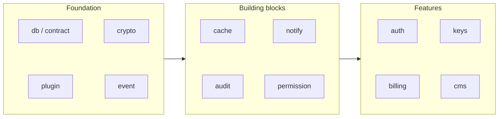

import Figure from "../../components/blocks/Figure.astro";
import Squiggle from "../../components/blocks/Squiggle.astro";
import PullQuote from "../../components/blocks/PullQuote.astro";
import Citation from "../../components/blocks/Citation.astro";

Better Auth nous a séduits. Pas pour l'auth en elle-même, mais pour la *forme* : une brique d'infrastructure agnostique, typée de bout en bout, qui vit dans notre code et pas dans le dashboard d'un tiers. Tu amènes ta base, elle amène la logique. Pas de SaaS au milieu, pas de données qui partent ailleurs.

Et puis on s'est posé la question évidente : pourquoi cette qualité-là s'arrête à l'authentification ?

Parce qu'une app n'a pas *un* besoin transverse. Elle en a vingt. Des permissions, un journal d'audit, du billing, des notifications, du file storage, des feature flags, des webhooks, du rate limiting. Aujourd'hui, on recolle tout ça à coups de vendors, un pour l'auth, un pour le paiement, un pour les mails, chacun avec son inscription, sa facture, et ses conditions appliquées à *vos* utilisateurs.

`@justwant`, c'est l'envie de répondre aux **90 % de besoins naturels** d'une app avec la même promesse que Better Auth, mais généralisée à tout : agnostique de l'infra, sans lock-in, et extensible quand le besoin se complique.

<Squiggle />

## Le constat : Better Auth est parfait, et c'est le problème

Better Auth fait une chose, et il la fait bien. Sessions, OAuth, 2FA, organisations, le tout sur ta propre base, avec un système de plugins propre. C'est exactement le modèle mental qu'on voulait partout.

<Citation
  quote="The most comprehensive authentication framework for TypeScript. Own your auth stack, your database, your rules, no vendor lock-in."
  author="Better Auth"
  source="better-auth.com"
  href="https://www.better-auth.com"
/>

Le souci n'est pas Better Auth. Le souci, c'est qu'il s'arrête à sa frontière. Dès que notre app a besoin d'un journal d'audit inviolable, on repart de zéro. Pour les permissions ABAC, on rebranche un autre outil. Pour le billing, on tombe chez Stripe et on accepte que nos lignes de facturation vivent chez eux. Pour les notifications, un Resend ici, un Twilio là, un Postmark ailleurs, chacun avec son SDK et sa propre idée d'un *template*.

Le résultat est toujours le même : une app, c'est dix modèles mentaux différents recollés. Dix façons d'écrire `init`, dix endroits où les données fuient, dix factures.

<PullQuote text="Une app moderne n'a pas un besoin d'infrastructure. Elle en a vingt. On les traite comme vingt problèmes étrangers, alors que c'est le même problème vingt fois." />

On voulait l'inverse : **un seul modèle mental**, décliné sur chaque besoin transverse. Tu apprends `@justwant` une fois, `createX`, un adapter, des plugins, des subpaths, et tu sais utiliser les vingt packages.

<Squiggle />

## La thèse : couvrir 90 %, brancher l'infra que tu possèdes déjà

Le pari tient en une phrase, celle qui ouvre le README : **un backend, une base de données, un bucket de stockage, c'est déjà une plateforme complète.**

Avec ces trois choses que tu as *déjà*, `@justwant` te donne : authentification, permissions, consentement RGPD, audit, observabilité, analytics, file storage, notifications, webhooks, rate limiting, feature flags, clés d'API, jobs planifiés, files d'attente, billing, CMS, waitlist, référral. Chaque package remplace un SaaS, sans en devenir un.

| Package | Remplace | Ce qu'il fait |
|---|---|---|
| `@justwant/auth` | Auth0, Clerk | Sessions, OAuth 40+, 2FA, passkeys, organisations, SCIM |
| `@justwant/permission` | | RBAC/ABAC : rôles, ownership, délégation, hiérarchie |
| `@justwant/billing` | Stripe Billing, Paddle | Plans, crédits, usage-based, essais, relances |
| `@justwant/notify` | Resend, Twilio, Postmark | Templates multi-canal, routing, digest, dédup |
| `@justwant/audit` | | Log immuable, chaînage HMAC, rétention, export |
| `@justwant/keys` | Unkey, Zuplo | Clés hashées, rate limit par clé, crédits, rotation |
| `@justwant/storage` | | Upload/download, multipart, URLs signées, scan |
| `@justwant/flag` | LaunchDarkly | Évaluation typée, rollout, targeting, A/B |

Le mot qui compte, c'est **agnostique**. `@justwant` ne t'impose ni Postgres, ni Redis, ni un cloud. Il te demande une seule chose : un *adapter*. Postgres, Drizzle, Prisma, Redis, Upstash, Cloudflare KV, ou ta propre implémentation. L'infra reste la tienne ; les données ne quittent jamais ton périmètre.

<PullQuote text="Pas de vendor lock-in. Pas de données qui sortent de ton infra. Pas de conditions tierces appliquées à tes utilisateurs." />

Et les 90 % ne sont pas un plafond. C'est un **socle** : la base couverte d'emblée, sur laquelle tu greffes la complexité spécifique à ton métier, un nouvel adapter, un plugin maison, sans jamais sortir du modèle.

<Squiggle />

## L'architecture : trois couches et une règle de dépendance stricte

Un écosystème de quarante packages qui s'importent librement, c'est un plat de spaghetti qui finit en dépendances circulaires. La seule façon que ça tienne, c'est une discipline de couches, imposée par construction.

`@justwant` se range en trois étages.

**Foundation.** Les primitives, sans aucune dépendance interne au repo. `meta` (types de base), `db` et `contract` (la couche d'accès aux données), `plugin` (le système de plugins lui-même), `id`, `crypto`, `env`, `lock`, `retry`, `event`, `context`, `cookie`, `config`. Tout le reste est bâti là-dessus.

**Building blocks.** Les préoccupations transverses réutilisables, qui combinent les primitives : `cache`, `job`, `queue`, `storage`, `protect`, `flag`, `preference`, `consent`, `permission`, `audit`, `webhook`, `notify`.

**Features.** Les packages à valeur produit directe, montés *entièrement* sur les deux groupes du dessous : `auth`, `keys`, `analytics`, `monitor`, `billing`, `cms`, `support`, `waitlist`, `referral`, `pipeline`.



La **règle de dépendance** est nette, et c'est elle qui rend le tout maintenable :

- Foundation n'importe **rien** du repo.
- Building blocks n'importent que Foundation.
- Features importent les deux, mais **jamais entre elles**.

Cette dernière contrainte est la plus importante. `auth` ne connaît pas `billing`. `billing` ne connaît pas `audit`. Comment communiquent-ils, alors ? Par un bus d'événements, `@justwant/event`. `auth` émet `user.created` ; `billing` y réagit pour ouvrir un compte, `audit` pour journaliser, sans qu'aucun ne sache que l'autre existe.

<PullQuote text="Deux features ne se parlent jamais en direct. Elles parlent à l'event bus. Tu peux retirer le billing sans toucher l'auth." />

Le découplage n'est pas un confort esthétique : c'est ce qui permet de prendre trois packages sans hériter des trente-sept autres.

<Squiggle />

## L'adapter : tu amènes la base, le package amène la logique

C'est le cœur de la promesse agnostique, et c'est la même idée que les *ports & adapters* d'Alistair Cockburn : la logique métier ne connaît pas le détail de la persistance, elle ne connaît qu'un contrat.

Chaque package qui touche au stockage accepte un `adapter`. La logique vit dans le package ; la base vit chez toi.

```ts
import { createAudit }    from "@justwant/audit";
import { prismaAdapter }  from "@justwant/audit/adapter-prisma";
import { drizzleAdapter } from "@justwant/audit/adapter-drizzle";
import { pgAdapter }      from "@justwant/audit/adapter-pg";

// Tu choisis ce qui colle à ta stack
const audit = createAudit({ adapter: prismaAdapter(prisma) });
const audit = createAudit({ adapter: drizzleAdapter(db, { schema }) });
const audit = createAudit({ adapter: pgAdapter(pool) });

// Ou tu implémentes le contrat à la main, pour n'importe quoi d'autre
const audit = createAudit({
  adapter: {
    async insert(event)      { /* ta logique */ },
    async findMany(filters)  { /* ta logique */ },
  },
});
```

Le même réflexe se décline partout. Le `cache` accepte un adapter mémoire, Redis, Upstash, Cloudflare KV, ou un adapter *tiered* qui empile un L1 mémoire devant un L2 Redis. Le `notify` accepte des *canals*, Resend pour l'email, Twilio pour le SMS, console en dev. Tu n'apprends pas un nouveau SDK par provider : tu apprends un contrat, et tu branches.

Et parce que tout passe par des contrats, la couche données est elle-même agnostique de l'ORM. `@justwant/contract` définit une table sans dépendre d'un schéma concret ; `@justwant/db` la mappe vers Drizzle, Prisma, Waddler, bun-sqlite, `pg` ou Neon, avec un `camelToSnake` par défaut.

```ts
import { defineContract } from "@justwant/contract";
import { uuid, string, email } from "@justwant/contract/fields";

const UserContract = defineContract("users", {
  id:    uuid().required().primaryKey(),
  email: email().required(),
  name:  string().optional(),
});
```

Le même contrat génère les migrations pour ta cible, sans réécrire une ligne :

```bash
npx justwant migrate generate --dialect postgres   # SQL brut
npx justwant migrate generate --adapter prisma     # blocs model Prisma
npx justwant migrate generate --adapter drizzle    # définitions de tables
```

<Squiggle />

## Le plugin : un cœur minimal, et des types qui s'étendent tout seuls

Si l'adapter rend `@justwant` agnostique de l'infra, le système de plugins le rend agnostique de la *complexité*. Chaque package a un cœur minimal. Tout le reste est un plugin opt-in, importé explicitement.

```ts
import { createAudit }     from "@justwant/audit";
import { integrityPlugin } from "@justwant/audit/plugin-integrity";
import { retentionPlugin } from "@justwant/audit/plugin-retention";
import { streamPlugin }    from "@justwant/audit/plugin-stream";
import { pgAdapter }       from "@justwant/audit/adapter-pg";

const audit = createAudit({
  adapter: pgAdapter(pool),
  plugins: [
    integrityPlugin(),                                       // chaînage HMAC
    retentionPlugin({ after: "90d", action: "anonymize" }), // RGPD
    streamPlugin({ destination: webhookAdapter() }),         // fan-out
  ],
});
```

Deux propriétés en découlent, et ce sont elles qui font la différence avec un gros SDK monolithique.

**Le tree-shaking par subpath.** Adapters et plugins sont des *exports de sous-chemin* isolés. Ton bundler ne charge que ce que tu importes, l'adapter Prisma que tu n'utilises pas n'entre jamais dans ton bundle. C'est le mécanisme standard des `exports` de Node, mis au service de la taille finale.

<Citation
  quote="When using the “exports” field, subpath exports allow a package to expose only specific entry points, keeping internal modules private and letting bundlers include only what is imported."
  author="Node.js"
  source="Documentation, Packages, subpath exports"
  href="https://nodejs.org/api/packages.html#subpath-exports"
/>

**Le declaration merging.** C'est le détail dont on est le plus content. Un plugin étend les *types* du package sans patcher son cœur. Le résultat reste entièrement typé, inféré directement depuis ta config : un champ n'apparaît dans l'autocomplétion *que* si le plugin qui le produit est actif.

```ts
// Avec creditsPlugin et rateLimitPlugin actifs sur @justwant/keys :
const result = await keys.verify("sk_live_abc123");

result.valid;              // toujours présent
result.credits.remaining;  // typé, seulement si creditsPlugin est actif
result.rateLimit.reset;    // typé, seulement si rateLimitPlugin est actif
result.permissions;        // typé, seulement si permissionPlugin est actif
```

C'est une technique de base de TypeScript, mais appliquée à un système de plugins, elle devient un super-pouvoir : la forme de l'API *est* ta configuration.

<Citation
  quote="Declaration merging means the compiler merges two separate declarations declared with the same name into a single definition."
  author="TypeScript"
  source="Handbook, Declaration Merging"
  href="https://www.typescriptlang.org/docs/handbook/declaration-merging.html"
/>

Le cœur reste petit. La complexité est opt-in. Et tu ne paies, en bundle comme en charge mentale, que ce que tu actives.

<Squiggle />

## Un package en entier : le cache, pour rendre le modèle concret

Tout ça reste abstrait tant qu'on n'a pas vu un package de bout en bout. Prenons `@justwant/cache` : il rejoue exactement le même schéma, `createX`, un adapter, des plugins, et montre ce que la cohérence apporte.

```ts
import { createCache } from "@justwant/cache";
import { memoryAdapter } from "@justwant/cache/adapters/memory";

const cache = createCache({ adapter: memoryAdapter(), defaults: { ttl: "1h" } });

await cache.set("user:123", data, { ttl: "5m", tags: ["user:123"] });
await cache.wrap("user:456", () => db.findUser("456"), { ttl: "5m" });
await cache.invalidateTag("user:123");

const ns = cache.namespace("users", { ttl: "10m" });
```

Les adapters couvrent tout le spectre infra sans changer une ligne d'appel : `memory`, `redis` (ioredis), `upstash`, `cf-kv` pour l'edge, et `tiered({ l1, l2 })` qui empile un cache mémoire devant Redis. Les plugins ajoutent à la carte : `encrypt` (chiffrement au repos), `stale` (servir périmé pendant le refetch), `dedupe`, `stats`, `prefetch`. Et un helper typé, `createCacheEntry`, fige la clé, le schéma de validation et les tags d'une entrée, pour ne plus jamais se tromper de forme.

Le point n'est pas le cache. Le point, c'est que tu viens d'apprendre `notify`, `audit`, `flag` et tous les autres : même `createX`, même adapter, mêmes subpaths, même validation par *Standard Schema* (zod, valibot, peu importe). Apprends-en un, tu les connais tous.

<Citation
  quote="A single, unified interface that any validation library can implement, so tools and libraries can accept user-defined schemas without coupling to one specific library."
  author="Standard Schema"
  source="standardschema.dev"
  href="https://standardschema.dev"
/>

<Squiggle />

## La stack, en bref

Le monorepo n'est pas qu'un dossier `packages/`. C'est la machine qui garde quarante librairies cohérentes et versionnées indépendamment.

| Couche | Choix | Pourquoi |
|---|---|---|
| Runtime | Bun 1.3 | install et exécution rapides, TypeScript natif, `bun test` intégré |
| Monorepo | Turborepo + workspaces Bun | orchestration de tâches, cache de build entre packages |
| Couche données | `contract` + `db` | contrats type-safe, agnostiques de l'ORM (Drizzle, Prisma, Waddler, pg, Neon) |
| Validation | Standard Schema | zod, valibot ou autre, jamais couplé à une lib |
| Système de plugins | `@justwant/plugin` | cœur minimal, graphe de dépendances, declaration merging |
| Découplage | `@justwant/event` | bus interne : les features ne se parlent jamais en direct |
| Qualité | Biome | un seul outil lint + format pour tout le repo |
| Releases | Release Please | versions et changelogs automatisés depuis les commits conventionnels |

Le choix de **versionner chaque package indépendamment** mérite un mot. Un correctif sur `@justwant/cache` ne force pas une montée de version de `@justwant/auth`. Tu prends ce dont tu as besoin, à la version que tu veux, sans subir le rythme du reste de l'écosystème.

<Squiggle />

## Ce qu'on en retient

Better Auth nous a appris qu'une brique d'infra bien faite a trois propriétés : elle est **agnostique** (tu amènes ton infra), **typée** (la config *est* l'API), et **sans tiers** (les données restent chez toi). La vraie idée de `@justwant`, ce n'est pas un package : c'est de prendre ces trois propriétés et de refuser qu'elles s'arrêtent à l'authentification.

Le reste découle d'une seule discipline : un modèle mental unique, `createX`, un adapter, des plugins, des subpaths, décliné sur chaque besoin transverse, tenu par une règle de dépendance stricte et un bus d'événements. Apprends-en un, tu les connais tous. Et tu ne paies que ce que tu actives.

## Et maintenant ?

Le socle couvre les 90 %. Ce qui m'attire désormais, c'est le dernier kilomètre : un **CLI de scaffolding** qui lit ton stack (ta base, ton bucket, ton cloud) et câble les adapters tout seul, pour que passer de zéro à *auth + billing + audit* sur ta propre infra soit l'affaire d'une commande. Le garde-fou, contrats typés, plugins opt-in, zéro lock-in, resterait exactement là où il est.

<Squiggle />

*[Better Auth](https://www.better-auth.com) · [Standard Schema](https://standardschema.dev) · [TypeScript, Declaration Merging](https://www.typescriptlang.org/docs/handbook/declaration-merging.html) · [Node.js, Subpath exports](https://nodejs.org/api/packages.html#subpath-exports) · [Hexagonal Architecture (Alistair Cockburn)](https://alistair.cockburn.us/hexagonal-architecture/) · [Turborepo](https://turborepo.com) · [Bun](https://bun.sh) · [Release Please](https://github.com/googleapis/release-please)*
