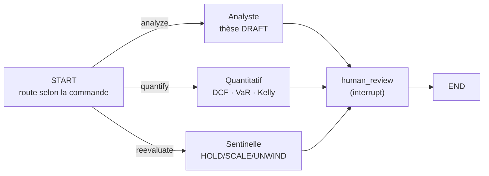

import Figure from "../../components/blocks/Figure.astro";
import Squiggle from "../../components/blocks/Squiggle.astro";
import PullQuote from "../../components/blocks/PullQuote.astro";
import Citation from "../../components/blocks/Citation.astro";

Les agents IA savent écrire du code dans un terminal. Lire un repo, lancer des commandes, committer. Je voulais voir s'ils pouvaient tenir autre chose : une discipline d'investissement.

OpenTrade, c'est cette expérience. Un agent qui lit des bilans, écrit une thèse, la valorise, surveille la position et la renvoie en réévaluation quand elle dérape. Le tout sans jamais quitter le terminal.

C'est un projet plus expérimental que mes autres. J'y ai mis deux choses qui m'obsédaient : ce que je sais de la finance, et l'envie de prouver qu'un terminal peut être beau.

<Squiggle />

## L'idée : un opencode, mais pour gérer un portefeuille

La vague des agents de code (Claude Code, OpenCode, les CLI qui vivent dans le terminal) a une forme qui me plaît : un binaire, une boucle, des outils, et l'humain qui valide aux moments qui comptent. Pas d'interface web, pas de friction. Tu parles, l'agent agit.

J'ai voulu transposer cette forme à un autre métier que le code : **l'investissement**.

Pas un bot de trading haute fréquence. L'inverse. Un assistant qui fait le travail lent et discipliné d'un gérant de fonds : comprendre une entreprise, écrire pourquoi on y croit, chiffrer combien elle vaut, dimensionner la position, et surveiller que la thèse tient toujours. Du *paper-trading* uniquement : c'est de la recherche, pas du conseil.

Le terminal n'est pas un caprice esthétique. Un gérant vit dans des tableaux, des séries de prix, des chiffres denses. Le terminal est l'endroit le plus naturel pour ça, à condition d'accepter d'y travailler le rendu. C'est précisément le pari du projet.

<Figure
  src="/work/opentrade/autocomplete.png"
  alt="Autocomplétion des commandes slash dans le TUI OpenTrade"
  caption="Tout passe par des commandes, comme dans un agent de code. /analyze, /quantify et /reevaluate déclenchent chacun l'un des trois agents."
  size="lg"
/>

<Squiggle />

## La discipline qu'on automatise

Avant d'écrire une ligne de code, il faut savoir quoi imiter. OpenTrade reproduit un cycle d'investissement classique, en quatre temps.

**La thèse.** On ne « achète pas une action ». On écrit pourquoi : un résumé argumenté, et surtout des **critères d'invalidation** concrets et observables : *« revenus en baisse de plus de 10 % en glissement annuel »*, *« marge brute sous 40 % »*. C'est ce qui sépare une conviction d'un pari : on décide *à l'avance* ce qui prouverait qu'on a eu tort.

**La valorisation.** Une thèse sans prix n'a pas de bord. On chiffre la valeur intrinsèque par un **DCF** (actualisation des flux de trésorerie futurs), on mesure le risque par la **VaR** (Value at Risk : combien on peut perdre, à quelle probabilité), et on dimensionne la position par le **critère de Kelly**, qui dit quelle fraction du capital engager selon l'espérance et la mise.

**L'ouverture.** Une position, dans le modèle : un prix d'entrée, une cible, une valeur nominale, et un lien vers la thèse qui la justifie. Le cash est débité d'un grand livre immuable (`cash_ledger`), comme une compta.

**La réévaluation.** Le plus négligé, et le plus important. Une position ouverte se surveille. Le prix a-t-il touché un critère d'invalidation ? Une publication a-t-elle changé la donne ? La réponse n'est pas binaire : **HOLD** (la thèse tient), **SCALE_IN** (on renforce), **SCALE_OUT** (on allège), **UNWIND** (on solde).

Ces quatre temps, je les ai confiés à trois agents.

<Squiggle />

## Trois agents, un workflow de fonds

Plutôt qu'un seul agent qui fait tout (et qui dérive), j'ai découpé le métier en trois rôles, comme dans un vrai fonds. Chacun est un agent **ReAct** (le modèle raisonne, appelle un outil, lit le résultat, recommence) avec sa boîte à outils.

<Citation
  quote="We explore the use of LLMs to generate both reasoning traces and task-specific actions in an interleaved manner, allowing for greater synergy between the two."
  author="Yao et al."
  source="ReAct: Synergizing Reasoning and Acting in Language Models, ICLR 2023"
  href="https://arxiv.org/abs/2210.03629"
/>

**L'Analyste** fait la recherche fondamentale. Il cherche les signaux dans l'actualité (`news_search`), télécharge le dernier 10-K ou 10-Q depuis SEC EDGAR (`sec_filing_downloader`), l'**indexe** dans une base vectorielle (`rag_indexer`), puis l'interroge en langage naturel (`rag_query` : *« quels sont les risques principaux ? »*). Il récupère le profil de l'actif (P/E, FCF, dette, trésorerie) et, au bout, écrit une thèse au statut `DRAFT` avec ses critères d'invalidation.

**Le Quantitatif** prend cette thèse et la chiffre. Fondamentaux sur 5 ans, 252 jours de cotation, puis DCF, VaR et dimensionnement Kelly. Il enrichit la thèse de ses résultats et la passe en `READY_FOR_REVIEW`.

**La Sentinelle** surveille les positions ouvertes. Elle compare le prix courant à l'entrée et à la cible, calcule le *drawdown*, relit le 10-K et les news pour vérifier que rien n'a cassé la thèse, puis recommande HOLD / SCALE_IN / SCALE_OUT / UNWIND et journalise tout.

Le chef d'orchestre est un graphe **LangGraph**. Il route la commande vers le bon agent et, point décisif, s'**interrompt avant le nœud `human_review`** :

L'agent ne passe jamais d'ordre tout seul. Il propose, l'humain dispose. L'état du graphe est *checkpointé* dans Postgres (`langgraph-checkpoint-postgres`), si bien qu'une interruption attend tranquillement la validation sans perdre le fil, même après un crash.

<PullQuote text="Un agent qui gère de l'argent ne doit jamais avoir le dernier mot. Il prépare la décision ; il ne la prend pas." />

<Squiggle />

## Le quantitatif : l'IA décide, mais ne calcule pas

C'est la décision la plus structurante du projet, et c'est la même leçon que partout ailleurs avec les LLM : **un modèle est créatif, pas fiable en arithmétique**. Lui demander de calculer un DCF de tête, c'est inviter le chiffre faux qui a l'air juste.

Alors je ne le lui demande pas.

Les trois calculs financiers vivent dans des **moteurs purs**, en TypeScript, sans une once d'IA :

- `dcf.engine.ts` : actualise les flux sur 5 ans, ajoute une valeur terminale `FCF₅ · (1+g) / (WACC − g)`, et sort trois scénarios *bull / base / bear* plus une marge de sécurité.
- `var.engine.ts` : VaR historique et paramétrique, à 95 % et 99 %, sur 1 et 10 jours, plus la CVaR (la perte moyenne dans la queue). Tout en dollars.
- `position-sizer.engine.ts` : Kelly complet `f* = (p·b − q) / b`, puis Kelly *fractionnaire* (un quart par défaut, parce que le Kelly plein est trop volatil pour qu'on dorme la nuit), enfin plafonné par la VaR et par une exposition maximale de 15 %.

Le rôle de l'IA s'arrête au bord du moteur. Elle décide *quelles hypothèses* poser (quel WACC, quelle croissance terminale, quelle probabilité de succès) et lit les résultats pour écrire la thèse. Le nombre, lui, vient toujours d'une fonction déterministe et testée.

Chaque résultat est contraint par un schéma **Zod** (`DCFResult`, `VaRResult`, `PositionSizingResult`). Le moteur ne peut pas rendre une forme inattendue, et l'agent ne peut pas inventer un champ. Contraindre la forme pour ne pas avoir à vérifier le fond : c'est le même réflexe que des *structured outputs*.

C'est la frontière qui rend le projet crédible. Le créatif (le raisonnement, la lecture des bilans) reste à l'IA ; le rigoureux (les maths qui engagent du capital) reste au code.

<Squiggle />

## Les données : payer pour savoir, ou payer pour se souvenir

Tout ce que font les agents repose sur une seule chose : des données de marché. Et c'est le poste le plus sous-estimé d'un projet comme celui-ci.

À la source, les données viennent des **places boursières** elles-mêmes : le NASDAQ, le NYSE produisent le flux brut des cotations. Mais on n'achète presque jamais directement chez elles. Tout un étage d'intermédiaires (les *vendors*) collecte ce flux, le stocke, le nettoie et le **revend** sous forme d'API. C'est tout un marché.

Et ce marché se paie selon deux axes. Plus on veut l'information **tôt** (la cotation en temps réel, à la milliseconde, pour être le premier à réagir), plus c'est cher. Et plus on veut de **profondeur historique** et de granularité (dix ans de données minute par minute plutôt que quelques mois de clôtures journalières), plus c'est cher aussi. Le temps réel intéresse les traders ; la profondeur intéresse les quants. Les deux coûtent.

OpenTrade n'est pas un projet à temps réel : c'est un assistant de recherche, il raisonne sur des clôtures journalières et des bilans trimestriels. Ça tombe bien, parce que c'est exactement la donnée la moins chère. J'utilise donc un mélange : **Yahoo Finance** (gratuit) en source principale pour les cotations et les historiques, **Alpaca** (en mode *paper*) en secours, et **FMP** (Financial Modeling Prep) et **Alpha Vantage** pour les fondamentaux. Ces deux derniers sont excellents, mais leurs paliers utiles sont payants, et tous imposent des quotas.

<PullQuote text="Une donnée historique ne change jamais. La clôture d'AAPL au 3 mars ne sera pas différente demain. Alors pourquoi la redemander ?" />

### Un cache adaptatif qui se souvient de tout

Le piège évident avec une API gratuite et quota-limitée, c'est le *too many requests*. La parade naïve serait de mettre un cache par requête : on garde la réponse à *« AAPL, 60 derniers jours »* pendant un moment. Mais c'est idiot, parce que la requête suivante (*« AAPL, 90 jours »*) ne réutilise rien.

J'ai pris le problème à l'envers. Je ne cache pas des *requêtes*, je cache des **points**. Chaque clôture journalière récupérée est stockée individuellement dans une table `price_points`. Une donnée du passé étant immuable, elle ne sera jamais refetchée.

À chaque demande, le service (`historical-price.service.ts`) fait un travail de couture :

1. Il regarde **ce qu'il a déjà** en base sur la plage demandée, et calcule précisément les jours de cotation **manquants**.
2. Il **regroupe** ces trous en plages contiguës, en enjambant les week-ends (un écart de 3 jours ou moins est considéré comme un seul trou), puis les aligne sur des blocs de 30 jours.
3. Il ne fetch via l'API **que ces trous**, derrière un *rate limiter* qui sérialise les appels pour ne jamais saturer le quota.
4. Et il en profite : à chaque fetch, il **sur-récupère** largement autour de la demande (jusqu'à un an à gauche, un mois à droite). On paie déjà l'appel, autant ramener plus de données qu'on stockera pour plus tard.

Le résultat est vertueux : **plus on utilise l'outil, moins il appelle l'API**. Les premiers `/chart` remplissent la base ; les suivants tapent de plus en plus dans le local. C'est ce que mesure le badge `CACHE HIT` affiché sur chaque graphique : la part de points servis sans toucher au réseau. Sur une deuxième requête identique, il monte à 100 %.

Les cotations live et les fondamentaux, eux, suivent une logique de TTL classique (cinq minutes pour un *quote*, vingt-quatre heures pour des fondamentaux), parce que ceux-là, eux, changent.

### Warehouse : et si la vraie valeur, c'était l'accès ?

En montant tout ça, une idée de produit s'est imposée, à côté du projet lui-même.

Configurer OpenTrade demande de jongler avec **plusieurs API**, chacune avec son inscription, sa clé, son quota, sa facturation à un endroit différent : une pour les cotations, une pour les fondamentaux, une pour les filings. C'est précisément la friction qui décourage quiconque voudrait construire ce genre d'outil.

D'où l'idée d'un service que j'aurais appelé **Warehouse** : une **API unique et unifiée**, intégrée nativement, qui donne accès d'un seul endroit aux données de cotation, aux historiques, et aux documents réglementaires, notamment les rapports que les sociétés américaines doivent déposer pour déclarer leurs résultats trimestriels et annuels (le **10-Q** trimestriel et le **10-K** annuel, auprès de la SEC, qu'OpenTrade télécharge déjà sur EDGAR).

Le modèle : un abonnement simple, de l'ordre de **5 à 10 € par mois**. Derrière, on agrège plusieurs *providers* et on absorbe la complexité (clés, quotas, *fallback*, normalisation) pour ne servir qu'une seule API propre. Une forme de revente, mais **structurée et clé en main** : *click and use, pay and use*, au lieu d'un après-midi de configuration. Le cache adaptatif d'OpenTrade serait le cœur d'un tel service : il transforme chaque requête payée en capital de données réutilisable.

C'est resté une idée. Mais c'est souvent comme ça : on construit un outil pour soi, et c'est en bricolant la plomberie qu'on aperçoit le vrai produit.

<Squiggle />

## Le vrai effort : rendre un terminal vivant

Voilà la partie où j'ai passé le plus de temps, et celle dont je suis le plus content. Tout ça vit dans un **TUI** bâti sur [Ink](https://github.com/vadimdemedes/ink) : React, mais qui rend dans le terminal au lieu du DOM. Un agent de finance qui sort des pavés de texte brut, ça n'a aucun intérêt. Il fallait que ça *montre*.

### Des graphiques dessinés à la main, en caractères

Pas de librairie de charts. Trois moteurs de rendu écrits de zéro, en caractères de dessin Unicode.

Le **chandelier** (`candle.ts`) utilise `┃` pour le corps de la bougie et `│` pour les mèches, vert si la clôture monte, rouge si elle baisse. Le **graphique en ligne** (`line.ts`) est en escalier, avec de vrais coins `╭ ╮ ╯ ╰` pour relier les segments. L'**aire** (`area.ts`) remplit le dessous d'un `░`. Un axe des prix aligné à droite ferme le tableau : `  273.73 ┤`.

Chaque bloc-graphique affiche son en-tête (ticker, période, plage de dates auto-formatée, comme *« 15 janv → 20 mars 25 »*), ses stats min/max/courant avec le pourcentage coloré, et même un **taux de cache** : vert si 100 % des points venaient du cache local, jaune sinon. Le rendu lourd est mémoïsé : un graphique posé ne se recalcule jamais.

<Figure
  src="/work/opentrade/app-use.png"
  alt="L'interface OpenTrade avec une barre de portefeuille, un graphique en ligne et un chandelier dessinés en caractères"
  caption="Le TUI en usage : barre de portefeuille, graphique en ligne et chandelier, tout en caractères Unicode. Le badge CACHE HIT (98 %) indique la part de points servis depuis le cache local."
  size="lg"
/>

### Une identité visuelle, pas juste du texte

Le thème est un vrai jeu de *design tokens* : un noir presque pur (`#0a0a0a`), des gris pour la hiérarchie des blocs (`#1a1a1a`), un texte clair, et, détail qui compte, un vert et un rouge **désaturés** (`#4a5c4a`, `#6b5050`) pour les états valide/erreur, parce que des couleurs saturées dans un terminal fatiguent l'œil. Les bougies, elles, gardent un vert et un rouge francs : c'est l'information, pas le décor.

### Le détail dont je suis le plus fier : les squelettes animés

Quand un agent va poser un graphique, je n'affiche pas un *spinner* générique. J'affiche un **chandelier qui s'anime** : huit bougies qui bougent comme un marché, une nouvelle toutes les 750 ms, le haut qui ne fait que monter et le bas que descendre. Le squelette ressemble déjà à ce qui va le remplacer. Quand la donnée arrive, on échange le bloc *en place* (`updateEntry`), sans flicker.

Et puisque j'y étais : après cinq minutes d'inactivité, le TUI bascule en **Coffee Mode**, un économiseur d'écran qui fait courir un marché imaginaire en plein écran, bougies plus larges et plus lentes. Une touche, et on revient. C'est gratuit, et c'est exactement le genre de détail qui fait qu'on a envie d'ouvrir l'outil.

<Figure
  src="/work/opentrade/coffee-mode.png"
  alt="Le Coffee Mode d'OpenTrade : un marché imaginaire en chandeliers, plein écran"
  caption="Coffee Mode : un marché imaginaire qui défile en plein écran après cinq minutes d'inactivité. Une touche pour revenir."
  size="lg"
/>

### Le streaming sans saccade

Le chat affiche le raisonnement des agents *token par token*. Naïvement, ça crée des centaines de re-rendus par seconde et ça saccade. Deux parades : un **accumulateur de delta** sur la molette (budget de 4 ms par frame), et un **auto-scroll throttlé** pendant le streaming. La vue est aussi **virtualisée** : les entrées hors écran ne sont pas rendues, juste des boîtes de la bonne hauteur, estimée par type (un graphique vaut 28 lignes, une commande 2). Au chargement d'une session, je pré-mesure les blocs hors écran par lots de 42 pour que le scroll ne saute jamais.

<Figure
  src="/work/opentrade/sessions.png"
  alt="La modale de restauration de session d'OpenTrade, listant les sessions passées"
  caption="Restaurer une session : chaque conversation est sauvegardée avec ses blocs, repré-mesurés hors écran avant l'affichage pour éviter tout saut de scroll."
  size="lg"
/>

Rien de tout ça n'est *nécessaire* pour que l'outil marche. Tout est nécessaire pour qu'on ait envie de s'en servir.

<Squiggle />

## Un agent, dix modèles

Comme dans un opencode, le modèle est interchangeable. Une *factory* LLM (`createLLM`) expose dix fournisseurs derrière LangChain : OpenAI, Anthropic, Google, Mistral, Groq, Cohere, Ollama (local), Together, Azure, OpenRouter. On change de cerveau à chaud, depuis le TUI, avec `/providers` et `/models` ; le choix est persisté dans `.opentrade-llm.json`.

La température est basse (0,2) pour limiter la fantaisie, et le *streaming* est activé pour alimenter à la fois l'affichage et la trace **Langfuse**, qui enregistre chaque appel par agent et par ticker. Quand un agent se trompe, je peux rejouer exactement ce qu'il a vu.

<Squiggle />

## La stack, en bref

| Couche | Choix | Pourquoi |
|---|---|---|
| Runtime | Bun 1.3 | install et exécution rapides, TypeScript natif |
| Agents | LangGraph + LangChain | graphe d'états, routing, *human-in-the-loop* |
| Persistance d'état | langgraph-checkpoint-postgres | reprises après interruption ou crash |
| Base | Postgres + TimescaleDB + pgvector | séries de prix, embeddings, métier dans une seule base |
| RAG | LlamaIndex + `text-embedding-3-small` | 10-K/10-Q découpés en chunks de 512 tokens |
| Données | Yahoo, Alpaca (paper), FMP, Alpha Vantage | quotes, fondamentaux, historiques, avec *fallback* |
| TUI | Ink + React 19 | rendu terminal composable, le cœur de l'effort |
| Stockage | S3 (S3Mock en local) | les PDF de bilans avant indexation |
| Validation | Zod | schémas pour les sorties d'outils et les résultats quant |

Le choix de tout mettre dans **une seule Postgres** mérite un mot : les séries temporelles (TimescaleDB), les vecteurs (pgvector) et le métier (Prisma) cohabitent. Pas de zoo de bases à orchestrer pour un projet expérimental.

<Squiggle />

## Ce que j'en retiens

Un agent qui manipule de l'argent ne se juge pas comme un agent de code. La qualité ne vient pas d'un meilleur prompt, mais d'une **frontière nette** : l'IA raisonne et lit, le code calcule et garde le dernier mot. Sortir les maths du modèle, contraindre les sorties par schéma, et toujours interrompre avant l'action : c'est ce qui transforme « un LLM qui parle finance » en outil dans lequel on aurait *presque* confiance.

Et le rendu n'est pas un bonus. Dans un terminal, un graphique propre, un squelette animé, un streaming fluide, c'est la différence entre une démo et un outil qu'on rouvre le lendemain.

## Et maintenant ?

OpenTrade reste une expérience : du paper-trading, des agents câblés à la main, un humain à chaque décision. La suite qui m'attire, c'est l'**autonomie surveillée** : laisser la Sentinelle tourner seule en continu sur les positions, et ne réveiller l'humain *que* lorsqu'un critère d'invalidation est touché. Le garde-fou déterministe (les moteurs, les schémas, l'interruption) resterait exactement là où il est.

<Squiggle />

*[ReAct (Yao et al., ICLR 2023)](https://arxiv.org/abs/2210.03629) · [LangGraph, Human-in-the-loop](https://langchain-ai.github.io/langgraph/concepts/human_in_the_loop/) · [Ink, React for CLIs](https://github.com/vadimdemedes/ink) · [Ed Thorp, The Kelly Criterion in Blackjack, Sports Betting, and the Stock Market](https://www.eecs.harvard.edu/cs286r/courses/fall12/papers/Thorpe_KellyCriterion2007.pdf) · [pgvector](https://github.com/pgvector/pgvector) · [TimescaleDB](https://www.timescale.com/) · [SEC EDGAR](https://www.sec.gov/edgar) · [Langfuse](https://langfuse.com)*
