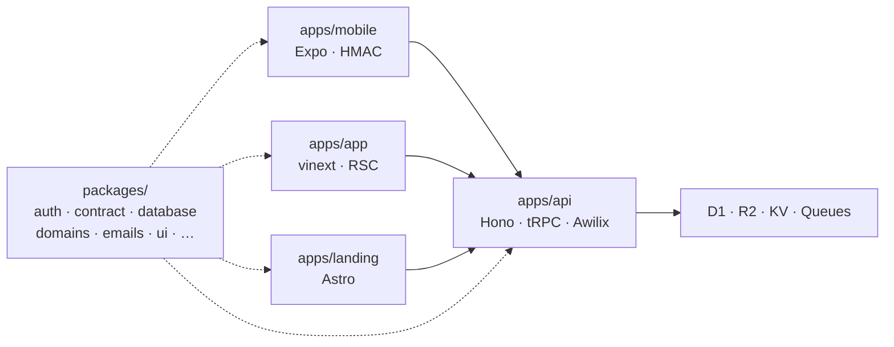
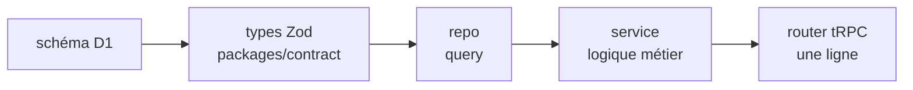

import Figure from "../../components/blocks/Figure.astro";
import Squiggle from "../../components/blocks/Squiggle.astro";
import PullQuote from "../../components/blocks/PullQuote.astro";
import Citation from "../../components/blocks/Citation.astro";

L'IA produit du code à la qualité du contexte qu'on lui donne et non pas uniquement à la qualité du modèle.

C'est la conclusion à laquelle je suis arrivé après avoir regardé Claude dériver progressivement sur [Discorads](https://discorads.com/fr), une régie pub pour serveurs Discord que je construisais en plusieurs repos séparés. Et c'est ce que Retardmaxxing essaie de résoudre : une boilerplate Cloudflare structurée pour que l'IA ait le contexte dont elle a besoin, et que vous ayez un produit complet dès le départ.

Il y a une trend sur Instagram en ce moment, des créateurs tech y prônent de déléguer absolument tout à Claude. Plus on s'efface derrière l'IA, plus on est productif, le terme qu'ils ont inventé pour ça, c'est le *retardmaxxing*. Ce projet à pour objectif d'aider les "retardmaxxer", en créant une fondation universel à 90% des produits, des conditions dans lesquelles l'IA produit quelque chose de bon nativement.

<Squiggle />

## Ce que j'ai cassé sur mon projet précédent

Discorads était fragmenté en trois repos séparés : un pour l'API, un pour le dashboard, un pour les workers.

Les types étaient redéfinis à chaque endroit. Il n'y avait aucun guide pour ajouter une feature. Et à mesure que le projet grossissait, les problèmes se sont accumulés : des imports vers des fichiers inexistants, de la logique métier dans les mauvaises couches, des abstractions inventées au lieu d'être réutilisées. Des incohérences de plus en plus difficiles à corriger.

L'enquête Qodo 2025 sur 600+ développeurs professionnels le confirme : **65% déclarent que l'IA rate du contexte critique lors des refactorisations**, et **~60% lors de la génération de tests**. Les problèmes de contexte sont cités *plus souvent que les hallucinations* comme cause principale des erreurs IA.

Le problème n'était pas les modèles. C'était le contexte.

Cette improvisation a un coût mesuré. GitClear a analysé 211 millions de lignes de code modifiées entre 2020 et 2024, dans des repos appartenant à Google, Microsoft et Meta. Leur conclusion : **le code dupliqué a augmenté de 8x sur la période**, et **le code réécrit dans les deux semaines suivant son ajout a doublé** (de 5,5% à 7,9%). Les blocs de code clonés sont associés à 15 à 50% de défauts supplémentaires selon la littérature citée dans le rapport. Le code IA qui improvise coûte du temps de maintenance.

Une frontière entre repos est une frontière de contexte. Un monorepo résout une partie de ça structurellement : l'IA voit les types, les tests, les dépendances, tous les sites d'appel, en même temps, dans un seul repo. Chaque frontière dégrade.

La recherche confirme aussi l'effet inverse. Nx a documenté **un développeur qui a complété son travail 4x plus vite** en utilisant Claude Code dans un workspace monorepo, avec nettement moins d'interruptions. Airbnb a compressé une migration de 18 mois en 6 semaines en laissant des agents IA parcourir l'ensemble du codebase en un seul passage, ce qui est très délicat dans une architecture multi-repo.

<Squiggle />

## next-forge pour Cloudflare, et pour tout le reste

<Figure src="/work/retardmaxxing/next-forge.png" alt="next-forge — boilerplate monorepo de référence" caption="next-forge, la référence du genre (~7 000 étoiles GitHub)" size="lg" />

Ce projet s'inspire directement de [next-forge](https://github.com/vercel/next-forge), une boilerplate de production créée par Hayden Bleasel, aujourd'hui sous l'organisation Vercel. next-forge est devenu la référence du genre : un monorepo Turborepo qui livre d'emblée une app marketing, une app principale, Stripe, Clerk, Sentry, Storybook. Tout câblé, tout cohérent. ~7 000 étoiles GitHub.

Son problème : il est entièrement Next.js + Vercel. Pas de mobile. Pas de Cloudflare. Pas de workers. Pas conçu pour sortir de cet écosystème.

Retardmaxxing part du même principe : **une base de production complète, rien à relier soi-même** — mais pour un périmètre plus large et une plateforme différente :

| | next-forge | Retardmaxxing |
|---|---|---|
| Plateforme | Vercel | Cloudflare |
| Mobile | ✗ | ✓ Expo (iOS + Android) |
| Auth | Clerk (SaaS) | Maison (SHA-256, PBKDF2) |
| Base de données | Prisma (externe) | D1 (Cloudflare, inclus) |
| Notifications | ✗ | ✓ Email + Push + Queue |
| Stack | Next.js uniquement | Hono + tRPC + Expo + Astro |

Cinq applications fonctionnelles, câblées entre elles dès le départ :

- **Une API** : le backend, sur Cloudflare Workers avec Hono et tRPC
- **Une app web** : avec rendu serveur RSC, pour les interfaces et les dashboards
- **Une landing page** : statique Astro, orientée SEO
- **Une app mobile** : iOS et Android, avec Expo Router
- **Un Storybook** : pour développer et documenter les composants en isolation

Chacune s'appuie sur une dizaine de packages partagés : authentification, paiements Stripe, emails, notifications push, composants visuels, règles métier. Tout est câblé et fonctionne ensemble. Pas de squelette à remplir.

<Squiggle />

## Le wizard au démarrage

La boilerplate n'est pas un kit monolithique à utiliser en entier. Elle est accompagnée d'un wizard guidé par Claude.

Au démarrage d'un nouveau projet, Claude pose quelques questions sur ce qu'on construit. Pas de mobile ? Il retire Expo. Pas de paiements ? Il enlève Stripe. Pas besoin de landing ? Elle disparaît. Le résultat est un projet taillé pour le cas d'usage, sans le bruit des features inutilisées.

Ce qui rend ça possible : la boilerplate embarque un `CLAUDE.md` et une suite de docs orientés tâche, écrits explicitement pour que Claude sache quoi faire et dans quel ordre, sans improviser. Claude connaît précisément la structure, et peut donc retirer des morceaux cohérents sans casser le reste.

<Squiggle />

## Pourquoi Cloudflare

La justification est surtout économique.

Pour **5$/mois** sur le plan Workers Paid, une application obtient du compute serverless distribué sur ~300 points de présence dans le monde, une base de données SQL (D1), du stockage objet (R2), un cache distribué (KV) et un système de files de messages (Queues). La même infrastructure sur AWS (Lambda + RDS + S3 + ElastiCache + SQS) coûte entre 50 et 100€/mois dès qu'on ajoute quelques utilisateurs, et demande plusieurs heures de configuration avant d'écrire la première ligne de code métier.

Baselime, après avoir migré d'AWS vers Cloudflare, a documenté ses résultats : **les coûts quotidiens sont passés de 1 940$ à 325$, soit une économie de 83%**. Lambda seul est passé de ~790$/jour à ~25$/jour.

<Citation
  quote="We moved our entire infrastructure from AWS to Cloudflare. Our daily costs dropped from $1,940 to $325 — an 83% reduction. Lambda specifically went from ~$790/day to ~$25/day."
  author="Baselime"
  source="How Baselime moved from AWS to Cloudflare, 2024"
  href="https://blog.cloudflare.com/80-percent-lower-cloud-cost-how-baselime-moved-from-aws-to-cloudflare/"
/>

Une part de cet écart tient à une différence de facturation souvent ignorée : **AWS facture la durée totale de l'invocation, y compris le temps d'attente réseau et base de données**. Cloudflare ne facture que le temps CPU réel. Sur une API qui passe 80% du temps à attendre une réponse D1, la différence est immédiate.

L'autre poste invisible sur AWS, c'est l'egress. S3 facture **0,09$/Go** de données sortantes. R2 facture **0,00$/Go**. Pour un projet qui sert 10 To de fichiers par mois, c'est ~900$/mois de différence sur un seul poste.

| Service | Cloudflare | AWS équivalent | Différence |
|---|---|---|---|
| Compute serverless | Workers (~5$/mois) | Lambda + API GW | 10–200% moins cher selon workload |
| Base SQL | D1 (inclus) | RDS minimal | Plusieurs dizaines d'€/mois |
| Stockage objet | R2 ($0 egress) | S3 ($0,09/Go egress) | ~$900/mois pour 10 To |
| Cache distribué | KV (inclus) | ElastiCache | ~50–100€/mois |
| Files de messages | Queues (inclus) | SQS | Négligeable à faible volume |

La plateforme couvre aussi bien plus que ce que cette boilerplate utilise. Workers, D1, R2, KV et Queues sont la fondation. L'écosystème inclut aussi du compute stateful (Durable Objects), de l'orchestration de tâches longues (Workflows), de l'inférence IA à l'edge (Workers AI), un WAF, du stockage vectoriel (Vectorize). Tout ça sans changer de plateforme si les besoins évoluent.

<Squiggle />

## Les décisions techniques qui méritent une explication

### Authentification maison plutôt que Clerk

<Figure src="/work/retardmaxxing/lucia.png" alt="Lucia Auth — documentation de référence pour l'auth custom" caption="Lucia Auth, archivé mais toujours la meilleure documentation d'auth" size="lg" />

La plupart des starters délèguent l'auth à Clerk ou Auth0, des SaaS où les sessions et les utilisateurs vivent sur des serveurs tiers, avec un pricing qui peut devenir significatif à l'échelle.

Ici l'auth tient dans quelques centaines de lignes. Sessions par token SHA-256, le token brut n'est jamais persisté, une base compromise ne suffit pas à usurper une session. Mots de passe PBKDF2-SHA256 à 210 000 itérations, conformément aux [recommandations OWASP](https://cheatsheetseries.owasp.org/cheatsheets/Password_Storage_Cheat_Sheet.html). OAuth Google et Apple via Arctic. Sur mobile, chaque requête est signée HMAC-SHA256 avec une clé stockée dans le trousseau sécurisé du téléphone : une requête interceptée ne peut pas être rejouée passé 5 minutes.

Ce choix vient de [Lucia Auth](https://lucia-auth.com), une bibliothèque que son créateur a archivée avec cette conclusion :

<Citation
  quote="Lucia's value was never really in the code itself, but in the documentation. For everyone who needs to understand how auth works before they can build something, this is still here."
  author="pilcrowonpaper"
  source="Lucia Auth — archivage, 2024"
  href="https://lucia-auth.com"
/>

Comprendre ce qu'on fait vaut mieux que configurer une boîte noire.

### Pourquoi presque tout produit finit par avoir besoin d'une queue

Les emails et les notifications push sont les cas évidents. Mais le problème qu'une queue résout est plus général : certaines actions dans une requête HTTP peuvent échouer sans que ça doive bloquer la réponse.

Sans queue, si le service d'email est momentanément indisponible au moment d'un signup, l'inscription échoue, alors que l'utilisateur a bien été créé. Avec une queue, la requête répond immédiatement, la tâche est exécutée en arrière-plan, et retentée si elle échoue. Le signup ne dépend plus de la disponibilité du service d'email.

Sur Cloudflare Queues, tout ça tourne sans infrastructure supplémentaire, inclus dans les 5$/mois.

### Une architecture en couches pour que l'IA ait un patron à imiter

<Figure src="/work/retardmaxxing/nestjs.png" alt="NestJS — architecture en couches et injection de dépendances" caption="NestJS : l'inspiration architecturale, sans le cold start" size="lg" />

Chaque feature suit le même chemin : schéma en base, types Zod partagés entre client et serveur, repository pour l'accès aux données, service pour la logique métier, router tRPC qui fait une ligne. Les règles métier pures vivent dans un package isolé, testable sans infrastructure.

Ce découpage s'inspire directement de NestJS, pas le framework lui-même, mais sa philosophie : des couches bien séparées, chacune avec une responsabilité claire, et de l'injection de dépendances pour relier le tout. C'est un pattern qui a fait ses preuves à grande échelle, et qui a l'avantage d'être immédiatement reconnaissable par n'importe quel développeur backend.

Le problème de NestJS dans ce contexte : c'est une usine à gaz. Le framework bootstrappe l'intégralité du graphe de dépendances au démarrage, ce qui peut prendre plusieurs secondes. Sur un serveur traditionnel qui tourne en permanence, c'est transparent. Sur un Cloudflare Worker qui démarre à froid à chaque invocation, c'est rédhibitoire.

La solution : [Awilix](https://github.com/jeffijoe/awilix), un container d'injection de dépendances léger, proche du TypeScript natif. La différence clé avec NestJS tient en un mécanisme : Awilix utilise des Proxy ES6 pour résoudre les dépendances **à la demande**, pas toutes d'un coup au démarrage. Une requête qui n'utilise que le service d'authentification n'instanciera jamais le service d'emails. Chaque classe est construite une seule fois par container (c'est le lifetime singleton) et réutilisée si elle est demandée à nouveau dans la même requête.

Le gain en testabilité est immédiat : pour tester un service, on remplace son repository par un mock dans le container, sans toucher au reste. Pas de `jest.mock()` global, pas de couplage implicite entre les couches.

Ce découpage profite à l'IA autant qu'au développeur. La recherche "Lost in the Middle" de Stanford a montré que les LLMs perdent **plus de 30% de précision** quand l'information pertinente est enterrée au milieu d'un contexte long : ils sur-pondèrent systématiquement le début et la fin. Un agent qui voit un projet sans structure claire improvise dans les zones d'ombre plutôt que de suivre un patron existant.

<Squiggle />

## Ce que j'en retiens

La boilerplate tourne en production. Trois projets dessus, dont deux freelance. Ça a validé les grandes lignes : le monorepo tient, l'arch en couches aide vraiment l'IA, Cloudflare est suffisant pour presque tout ce qu'on peut vouloir construire à ce stade.

Mais ce que j'ai surtout appris, c'est que la structure d'un projet est une forme de communication. Pas uniquement entre développeurs, mais surtout entre vous et l'IA qui va travailler avec vous. Chaque décision d'architecture est aussi une décision de contexte : est-ce que l'agent va comprendre ce qu'il y a ici, ou est-ce qu'il va improviser ?

Ce projet m'a forcé à être explicite sur des choses que j'aurais autrement laissées implicites. Et l'explicite, ça profite à tout le monde : à l'IA, aux collaborateurs humains, et à moi-même six mois plus tard.

Pour la suite : je ne sais pas exactement où ça va. Les outils changent vite. Ce qui est certain, c'est que je vais continuer à itérer dessus au fil de mes projets. Chaque nouveau produit que je construis dessus révèle quelque chose à corriger ou à simplifier.

<Squiggle />

*[next-forge — Vercel](https://github.com/vercel/next-forge) · [GitClear AI Code Quality 2025](https://www.gitclear.com/ai_assistant_code_quality_2025_research) · [Qodo State of AI Code Quality 2025](https://www.qodo.ai/reports/state-of-ai-code-quality/) · [Nx — AI + Monorepo productivity](https://nx.dev/blog/the-missing-multiplier-for-ai-agent-productivity) · [Baselime — AWS to Cloudflare migration](https://blog.cloudflare.com/80-percent-lower-cloud-cost-how-baselime-moved-from-aws-to-cloudflare/) · [Cloudflare R2 vs AWS S3](https://www.cloudflare.com/pg-cloudflare-r2-vs-aws-s3/) · [Liu et al. — Lost in the Middle (Stanford)](https://arxiv.org/html/2601.11564v1) · [OWASP Password Storage](https://cheatsheetseries.owasp.org/cheatsheets/Password_Storage_Cheat_Sheet.html) · [Lucia Auth](https://lucia-auth.com) · [Cloudflare Workers — Limits](https://developers.cloudflare.com/workers/platform/limits/)*
